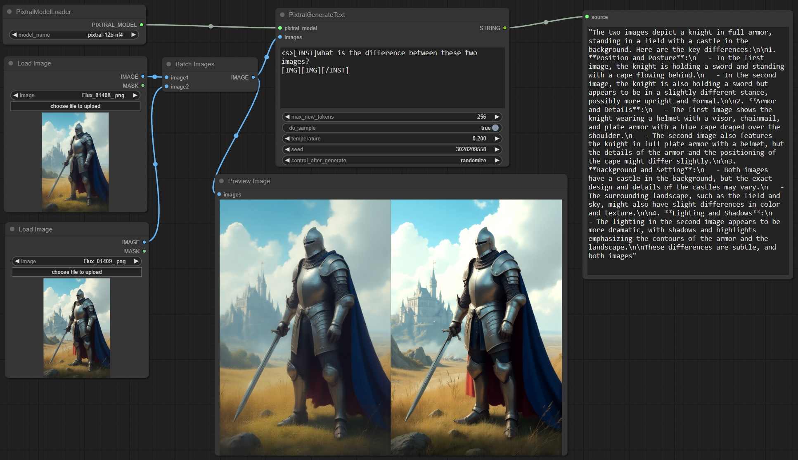

# ComfyUI-PixtralLlamaVision
 For loading and running Pixtral and Llama 3.2 Vision models

Includes four nodes:
- PixtralModelLoader
- PixtralGenerateText
- LlamaVisionModelLoader
- LlamaVisionGenerateText

These should be self-explanatory.
 
Install the latest version of transformers, which has support for Pixtral/Llama Vision models:
`python_embeded\python.exe -m pip install git+https://github.com/huggingface/transformers`

Requires transformers 4.45.0 for Pixtral and 4.46.0 for Llama Vision.

Also install bitsandbytes if you don't have it already:
`python_embeded\python.exe -m pip install bitsandbytes`

Models should be placed in the `ComfyUI/models/pixtral` and `ComfyUI/models/llama-vision` folders, with each model inside a folder with the `model.safetensors` file along with any config files and the tokenizer.

You can get a 4-bit quantized version of Pixtral-12B which is compatible with these custom nodes here: [https://huggingface.co/SeanScripts/pixtral-12b-nf4](https://huggingface.co/SeanScripts/pixtral-12b-nf4)

You can get a 4-bit quantized version of Llama-3.2-11B-Vision-Instruct which is compatible with these custom nodes here:
[https://huggingface.co/SeanScripts/Llama-3.2-11B-Vision-Instruct-nf4](https://huggingface.co/SeanScripts/Llama-3.2-11B-Vision-Instruct-nf4)

Example Pixtral image captioning (not saving the output to a text file in this example):

Example Pixtral image comparison:

I haven't been able to get image comparison to work well at all with Llama Vision. It doesn't give any errors, but the multi-image understanding just isn't there. The image tokens have to be **before** the question/instruction and consecutive for the model to even be able to see both images at once (I found this out by looking at the image preprocessor cross-attention implementation), and even then, it seems to randomly mix up which is the first/second, left/right, the colors between them and other details. It doesn't seem usable for purposes involving two images in the same message, in my opinion.

Since Pixtral directly tokenizes the input images, it's able to handle them inline in the context, with any number of images of any aspect ratio, but it's limited by token lengths, since each image can be around 1000 tokens.